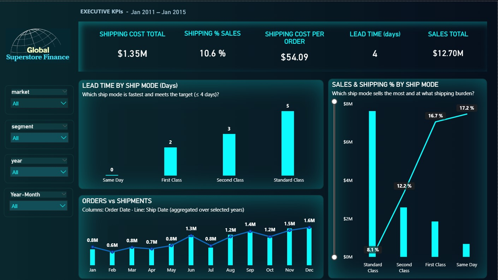

# 📊 Global Superstore Finance — SQL & Power BI Project

**ETL → Star Schema → KPIs → Dashboards (Power BI) with BI governance (read-only role & contract views).**  
Portfolio project simulating an enterprise-grade financial analytics pipeline.

  <a href="dashboards/powerbi/templates/GlobalSuperstore_Finance_Dashboard.pbit"><b>⬇️ Download PBIT template</b></a> ·
  <a href="#-power-bi--pages--insights"><b>📺 See dashboard pages</b></a> ·
  <a href="./docs/README.md"><b>📘 Detailed README</b></a>

  

---

## 🔎 Business questions answered
- Where does revenue come from (acquisition vs. returning) and which segments/categories drive **margin**?
- Are sales improving **MoM** and **YoY**? Which **quarters/months** concentrate demand?
- Which **ship mode** sells the most and at what **logistics burden**? Are we meeting the **≤ 4-day SLA**?  
- Is there **backlog** (orders vs. shipments)?

---

## 🚀 Repository Structure
- 📂 **[sql_scripts/](./sql_scripts/)** → SQL scripts organized by ETL, Modeling, BI, and Admin.  
- 📂 **[docs/](./docs/)** → Documentation, diagrams, and design notes.  
- 📂 **[dashboards/](./dashboards/)** → Power BI (.pbix/.pbit), screenshots, and visual themes.  

---

## 📑 Folder Index
- 🔹 **ETL** → [See scripts](./sql_scripts/etl)  
- 🔹 **Modeling** → [See scripts](./sql_scripts/modeling)  
- 🔹 **BI** → [See scripts](./sql_scripts/bi)  
- 🔹 **Admin** → [See scripts](./sql_scripts/admin)  
- 🔹 **Docs** → [See documentation](./docs)  
- 🔹 **Dashboards** → [See dashboards](./dashboards)  

---

## 🎯 Purpose
This repository demonstrates a full **Financial Analytics** workflow:
1. **ETL** → Load and cleanse raw data (STAGE → RAW → CLEAN).  
2. **Modeling** → Star schema (FACT + DIM) and financial KPIs.  
3. **BI** → Business views for Power BI dashboards.  
4. **Admin** → Security, performance, and governance.  
5. **Docs** → ER diagrams and design decisions.  
6. **Dashboards** → Final storytelling with Power BI.

---

## 🖥️ Power BI — Pages & insights

### 01 — Financial Overview
*Revenue mix, segment performance & margin, discount vs. margin with thresholds.*

  

**Key insights (sample):**
- **~70% del revenue** proviene de **clientes recurrentes** de forma consistente (2011–2014).  
- **Consumer** lidera ventas (~**$6.5M**); **Home Office** logra el **mayor margen** (~**11.9%**).  
- Por **categoría**: **Technology** lidera (~**$4.7M**, margen ~**14%**); **Furniture** vende similar (~**$4.1M**) pero con **margen más bajo** (~**6.9%**).  
- **Descuento vs. margen**: mediana de **margen 13.8%** y **descuento 9%**; *Tables* cae en cuadrante **alto descuento / margen negativo** (evitar).

---

### 02 — Time & Seasonality
*MoM/YoY trends, best quarters/months; heatmap by month/year.*

  

**Key insights (sample):**
- **Crecimiento YoY** sostenido (panel muestra **~47%**), con aceleraciones entre **ago–nov**.  
- **Q4** es el **trimestre pico** cada año (2014 Q4 ~**$1.49M**).  
- **Diciembre** domina el **mes pico** de ventas de forma consistente.

---

### 03 — Shipping & Operations
*SLA (≤4 días) por modo, ventas vs. shipping %, órdenes vs. despachos (backlog).*

  

**Key insights (sample):**
- **SLA**: Same Day (0d), First (2d) y Second (3d) cumplen; **Standard = 5d** (no cumple, foco operacional).  
- **Eficiencia**: **Standard** concentra ventas (~**$7.6M**) con **menor Shipping %** (~**8.1%**) y **$40.61** por orden; **Same Day** tiene **mayor carga** (~**17.2%**, **$86/orden**).  
- **Órdenes vs. despachos**: picos de **despachos > órdenes** en fines de año indican **descarga de backlog** (enero vuelve a equilibrio).

**DAX Highlights**
- Safe deltas: robust **`Safe % vs LM/LY`** against slicers and missing months.  
- Time intelligence: **`YTD`**, **`MoM`**, **`YoY`** measures.  
- Usability: context-aware tooltips, KPI labels, curated views for BI consumption.

**Governance**
- Read-only BI user (**`bi_reader`**) with **SELECT-only** privileges.  
- Published **contract views** in the `global_superstore_bi` schema.

---

## 🧪 How to run (short)

**1) SQL**
- Create the DB and run scripts in **`sql_scripts`** in order: `etl/` → `modeling/` → `bi/` → `admin/`.  
- The read-only BI user **`bi_reader`** (role & grants) is created in `sql_scripts/admin`.

**2) Power BI**
- Open the template: `dashboards/powerbi/templates/GlobalSuperstore_Finance_Dashboard.pbit`.  
- Point the connection to schema **`global_superstore_bi`** (contract views).  
- Refresh the model.

> Need the full step-by-step? See **[Detailed README](./docs/README.md)**.

---

## 📌 Dataset
- **Source**: [Global Superstore Dataset](https://www.kaggle.com/datasets/vivek468/superstore-dataset-final)  
- **Use**: Public dataset for Data Analytics practice.

---

## 🛠️ Tech Stack
- **SQL** (MySQL / compatible)  
- **Power BI** (DAX)  
- **GitHub** (documentation & version control)

---

## 👩‍💻 Author
Project by **Daiana Beltrán**  
[LinkedIn](https://www.linkedin.com/in/daiana-beltran/) · [GitHub](https://github.com/daiana-analytics)
