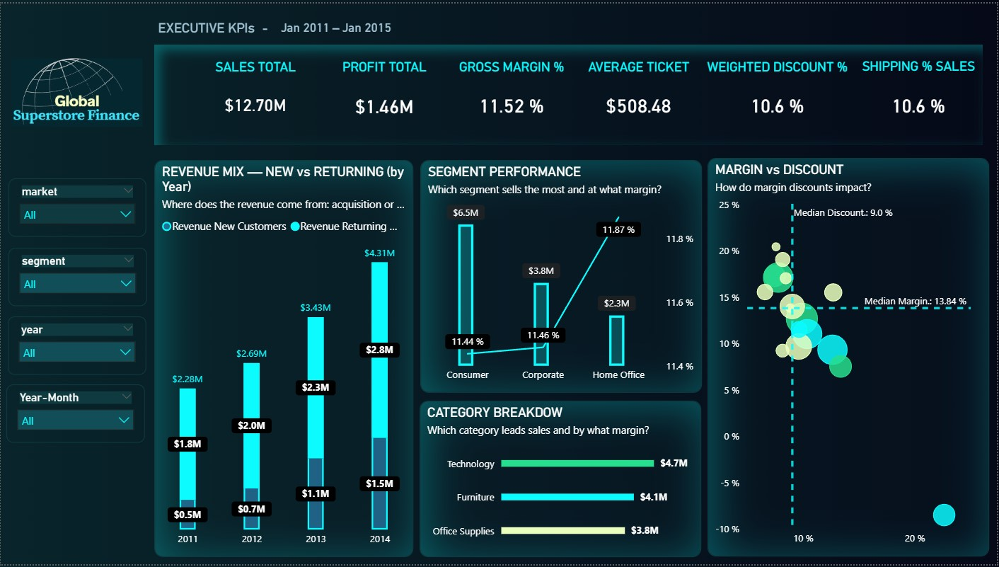
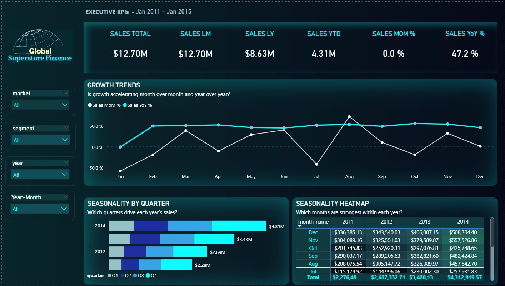

# 📊 Global Superstore Finance — SQL & Power BI Project

**ETL → Star Schema → KPIs → Dashboards (Power BI) with BI governance.**  
Portfolio repository simulating an enterprise-grade financial analytics pipeline.

  

---

## 🚀 Repository Structure

- 📂 [sql_scripts/](./sql_scripts/) → SQL scripts organized by ETL, Modeling, BI, and Admin.  
- 📂 [docs/](./docs/) → Documentation, diagrams, and design notes.  
- 📂 [dashboards/](./dashboards/) → Power BI template (.pbit), demo GIF, and screenshots.  

---

## 📑 Folder Index

- 🔹 **ETL / Modeling / BI / Admin (SQL)** → [See scripts](./sql_scripts/)  
- 🔹 **Docs** → [See documentation](./docs/README.md) · ERD: [erd_global_superstore_finance.png](./docs/img/erd_global_superstore_finance.png) · Power BI star view: [powerbi-star-schema.png](./docs/img/powerbi-star-schema.png)  
- 🔹 **Dashboards (Power BI)** → [Open folder](./dashboards/powerbi/) · Template: [`GlobalSuperstore_Finance_Dashboard.pbit`](./dashboards/powerbi/templates/GlobalSuperstore_Finance_Dashboard.pbit) · Demo GIF: [`powerbi-dashboard-demo.gif`](./dashboards/powerbi/assets/powerbi-dashboard-demo.gif) · Screenshots:  
  [01 – Financial Overview](./dashboards/powerbi/assets/01-financial-overview.png) ·
  [02 – Time & Seasonality](./dashboards/powerbi/assets/02-time-and-seasonality.png) ·
  [03 – Shipping & Operations](./dashboards/powerbi/assets/03-shipping-operations.png)

---

## 🎯 Purpose

This repository demonstrates a full **Financial Analytics** workflow:

1. **ETL** → Load and cleanse raw data (STAGE → RAW → CLEAN).  
2. **Modeling** → Star schema (FACT + DIM) and financial KPIs.  
3. **BI** → Business views for Power BI dashboards.  
4. **Admin** → Security, performance, and governance.  
5. **Docs** → ER diagrams and design decisions.  
6. **Dashboards** → Final storytelling with Power BI.

---

## 📈 Power BI — Pages & Insights

- **01 – Financial Overview**  
  Answers: Where does revenue come from (new vs. returning)? Which segment/category leads and at what margin? How do discounts affect margin?  
  

- **02 – Time & Seasonality**  
  Answers: Are sales improving MoM and YoY? Which quarters/months are strongest?  
  

- **03 – Shipping & Operations**  
  Answers: Are we meeting the SLA (lead time)? Which ship mode sells more and at what shipping burden? Any gap between orders and shipments?  
  

**DAX Highlights**
- **Safe deltas**: *Safe % vs LM/LY* (guards against divide-by-zero and missing months).  
- **Time-intelligence**: YTD, MoM/YoY trends.  
- **Usability**: constant lines/targets, tooltip measures, curated labels.

**BI Governance**
- Read-only BI user (`bi_reader`) with **SELECT-only** privileges.  
- Published **contract views** for stable Power BI binding.

---

## 🧪 How to Run (short)

**SQL**
1. Create DB and run scripts in [`sql_scripts/`](./sql_scripts/) (order by prefix: `00_…` → `15_…`).
2. Ensure the BI user (`bi_reader`) is created and granted (see admin scripts).

**Power BI**
1. Open the template: [`GlobalSuperstore_Finance_Dashboard.pbit`](./dashboards/powerbi/templates/GlobalSuperstore_Finance_Dashboard.pbit).  
2. Point the connection to schema **`global_superstore_bi`**.  
3. Refresh the model.

---

## 📌 Dataset

- **Source**: [Global Superstore Dataset](https://www.kaggle.com/datasets/vivek468/superstore-dataset-final)  
- **Use**: Public dataset for Data Analytics practice.

---

## 🛠️ Tech Stack

- **SQL** (MySQL / compatible)  
- **Power BI** (DAX)  
- **GitHub** (documentation & version control)

---

## 👩‍💻 Author

Project by **Daiana Beltrán**  
[LinkedIn](https://www.linkedin.com/in/daiana-beltran/) · [GitHub](https://github.com/daiana-analytics)

---

> 👉 Looking for the full technical documentation? See the **[Detailed README](./docs/README.md)**.
