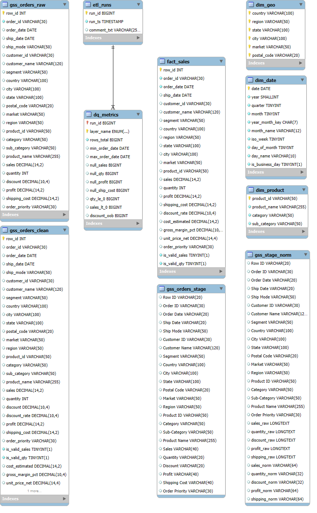
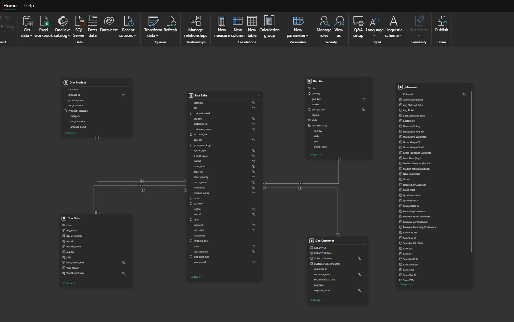
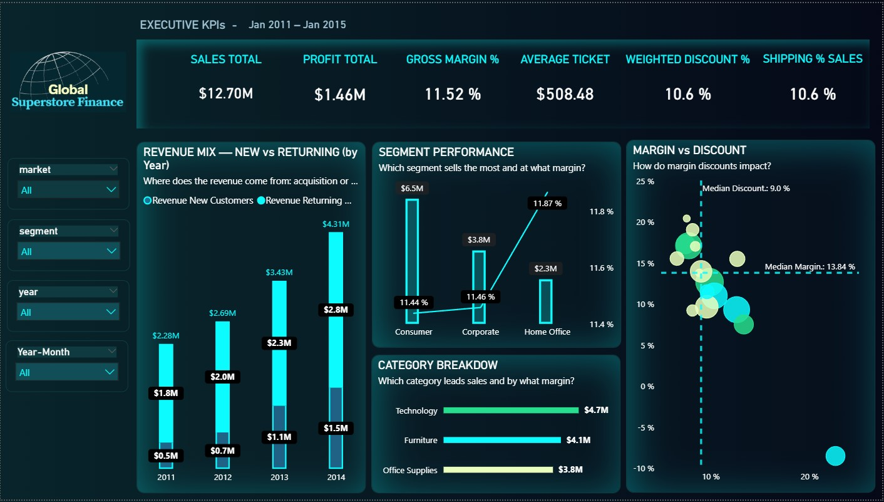
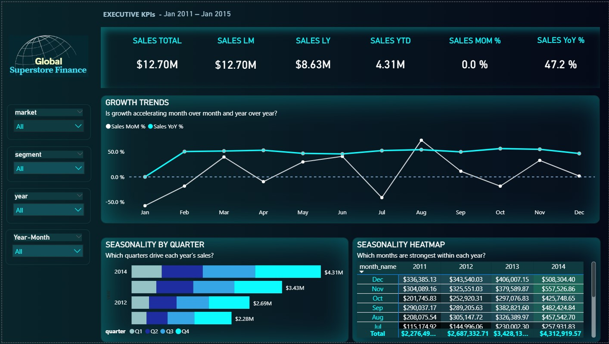
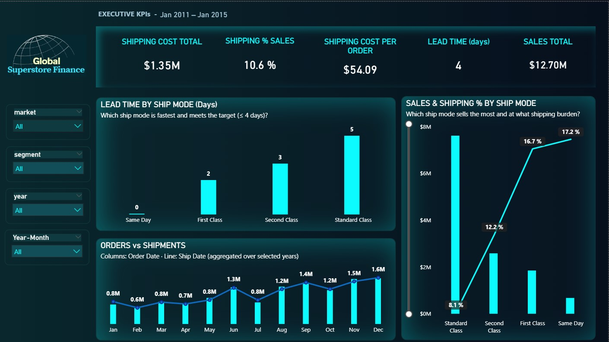

← Back to overview: [Root README](../README.md)

# 📊 Global Superstore — Financial Analytics & BI (Detailed)

**Author:** Daiana Beltrán  
**Stack:** MySQL 8 • SQL (ETL, DQ, Modeling, Security) • Power BI (DAX & Storytelling)

---

## Table of Contents
- [Executive Summary](#executive-summary)
- [Business Questions](#business-questions)
- [Scripts Index](#scripts-index)
- [Data Model](#data-model)
  - [ERD](#erd)
  - [Star schema (Power BI)](#star-schema-power-bi)
- [Power BI — Pages & insights](#power-bi--pages--insights)
  - [01 — Financial Overview](#01--financial-overview)
  - [02 — Time & Seasonality](#02--time--seasonality)
  - [03 — Shipping & Operations](#03--shipping--operations)
- [DAX Highlights](#dax-highlights)
- [KPI Dictionary (SQL ↔ DAX)](./kpi_dictionary.md)
- [How to Run (step-by-step)](#how-to-run-step-by-step)
- [Security Architecture](#security-architecture)
- [Run Order](#run-order)

---

## Executive Summary
End-to-end **financial analytics** pipeline with professional BI governance:

- **Robust ETL:** CSV → STAGE → RAW → CLEAN → STAR (guarded casts, data-quality checks).
- **Star Schema:** FACT Sales + DIM Date/Product/Customer/Geo (BI-ready).
- **Finance KPIs:** curated SQL views for revenue, profit, margin %, ticket, discounts, shipping burden.
- **BI Contract Views:** schema `global_superstore_bi` for safe, stable consumption.
- **Security:** read-only BI role/user with **SELECT-only** privileges.
- **Power BI:** executive storytelling with reliable MoM/YoY/YTD and **safe deltas** under slicers.

**Outcome:** a portfolio-grade, enterprise-style BI solution.

---

## Business Questions
1) Where does **revenue** come from (acquisition vs. returning)? Which **segments/categories** drive **margin**?  
2) Are sales improving **MoM** and **YoY**? Which **quarters/months** concentrate demand?  
3) Which **ship mode** sells the most and at what **logistics burden**? Are we meeting the **≤ 4-day SLA**?  
4) Is there **backlog** (orders vs. shipments)?

---

## Scripts Index
> Paths are relative to the repo root. Run in **numeric order**.

### ETL — `../sql_scripts/etl`
- [`00_create_database.sql`](../sql_scripts/etl/00_create_database.sql) — Create DB schema `global_superstore_finance`.
- [`01_create_stage_table.sql`](../sql_scripts/etl/01_create_stage_table.sql) — STAGE table (raw CSV import).
- [`02d_build_stage_norm.sql`](../sql_scripts/etl/02d_build_stage_norm.sql) — Normalize numeric strings.
- [`02d_fix_hyphen_decimal.sql`](../sql_scripts/etl/02d_fix_hyphen_decimal.sql) — Fix hyphen-as-decimal anomalies.
- [`02e_load_raw_from_stage_norm.sql`](../sql_scripts/etl/02e_load_raw_from_stage_norm.sql) — Load RAW (guarded casts).
- [`03_load_clean_from_raw.sql`](../sql_scripts/etl/03_load_clean_from_raw.sql) — Build CLEAN layer (flags + ready-to-model).
- [`05_data_quality_audit.sql`](../sql_scripts/etl/05_data_quality_audit.sql) — DQ framework (`etl_runs`, `dq_metrics`, `dq_issues`).

### Modeling — `../sql_scripts/modeling`
- [`06_views_fact.sql`](../sql_scripts/modeling/06_views_fact.sql) — FACT Sales (valid sales only).
- [`07_views_dimensions.sql`](../sql_scripts/modeling/07_views_dimensions.sql) — DIM views (date, product, geo).
- [`08_materialize_star.sql`](../sql_scripts/modeling/08_materialize_star.sql) — Materialize FACT + DIM tables.
- [`09_financial_kpis.sql`](../sql_scripts/modeling/09_financial_kpis.sql) — KPI views (Revenue, Profit, Margin %, Ticket, Top N, Geo, Monthly).

### BI — `../sql_scripts/bi`
- [`04_views_dashboard.sql`](../sql_scripts/bi/04_views_dashboard.sql) — Executive & finance views.
- [`10_dashboard_views.sql`](../sql_scripts/bi/10_dashboard_views.sql) — Time, product, geo, customer, logistics views.
- [`14_publish_bi_views.sql`](../sql_scripts/bi/14_publish_bi_views.sql) — Publish contract views (& optional FACT/DIM).

### Admin — `../sql_scripts/admin`
- [`11_admin_and_security.sql`](../sql_scripts/admin/11_admin_and_security.sql) — Performance tuning + base BI user.
- [`12_bi_role_user.sql`](../sql_scripts/admin/12_bi_role_user.sql) — Role/User (parametrized, idempotent).
- [`13_bi_schema_and_grants.sql`](../sql_scripts/admin/13_bi_schema_and_grants.sql) — Curated BI schema & SELECT grants.
- [`15_verification_tests.sql`](../sql_scripts/admin/15_verification_tests.sql) — Automated BI validation (SELECT-only).

---

## Data Model

- [ERD](#erd)
- [Star schema (Power BI)](#star-schema-power-bi)

Star schema for analytical consumption (FACT + DIM) with curated BI contract views.

### ERD

  

### Star schema (Power BI)

  

---

## KPI Dictionary (summary)
Key measures available in SQL views (also mapped to DAX):

- **Revenue / Profit / Gross Margin %**
- **Average Ticket**
- **Weighted Discount %**
- **Shipping % of Sales / Shipping Cost per Order**
- **MoM / YoY / YTD**
- **Top-N Products/Customers; Geo splits; Monthly trends**

> Full SQL ↔ DAX mapping can live in `docs/kpi_dictionary.md` (optional).

---

## Power BI — Pages & Insights

### 01) Financial Overview

**Notable insights (2011–2014):**
- **Revenue mix:** ≈ **70%** of sales from **returning** customers (repeat rate ≈ 64–81% by year).  
- **Segments (Sales / Margin %):** Consumer **$6.54M** / ~11.4% · Corporate **$3.84M** / ~11.5% · Home Office **$2.33M** / ~11.9%.  
- **Categories:** Technology **$4.74M** / ~**14%** · Furniture **$4.12M** / ~**6.9%** · Office Supplies **$3.84M** / ~**13.5%**.  
- **Discount vs. Margin:** medians **9.0%** (discount) and **13.84%** (margin). **Tables** falls into **high-discount / negative-margin** → avoid/reprice.

---

### 02) Time & Seasonality

**Notable insights:**
- **YoY growth:** headline ≈ **+47.2%** across the period.  
- **Quarter seasonality:** **Q4-2014 ≈ $1.49M** (peak), followed by **Q4-2013 ≈ $0.94M**.  
- **Top months:** **December** leads every year (e.g., **$508k** in 2014), with **Nov/Sep** as secondary peaks.

---

### 03) Shipping & Operations

**Notable insights:**
- **SLA (≤ 4 days):** Same Day **0d**, First **2d**, Second **3d** meet target; **Standard = 5d** → **out of SLA**.  
- **Efficiency by mode:** Standard **$7.61M**, **8.1%** shipping and **$40.61/order** (lowest burden). Same Day is **most expensive** (~**17.2%**, **$86/order**).  
- **Orders vs. shipments:** year-end **shipments > orders** indicates **backlog clearance**; **January** re-balances.

---

## DAX Highlights
- **Safe deltas:**  
  `Safe % vs LM = DIVIDE([Sales Total] - [Sales LM], [Sales LM], 0)`  
  `Safe % vs LY = DIVIDE([Sales Total] - [Sales LY], [Sales LY], 0)`
- **Time intelligence:** `TOTALYTD([Sales Total], 'Dim Date'[date])`
- **Weighted discount:**  
  `Discount % Weighted = DIVIDE(SUMX('Fact Sales','Fact Sales'[sales]*'Fact Sales'[discount_rate]), [Sales Total])`
- **Shipping per order:**  
  `Shipping Cost per Order = DIVIDE([Shipping Cost Total], [Orders])`
- **Use ship-date relationship:**  
  `Sales by Ship Date = CALCULATE([Sales Total], USERELATIONSHIP('Fact Sales'[ship_date], 'Dim Date'[date]))`

---

## 🚀 How to Run (step-by-step)

### 1) SQL
1. Create DB and run scripts in `../sql_scripts` in order: **etl/** → **modeling/** → **bi/** → **admin/**.  
2. The read-only BI user **`bi_reader`** (role & grants) is created under **admin/**.  
3. Verification tests ensure the BI user can **SELECT** only.

### 2) Power BI
1. Open the template: `../dashboards/powerbi/templates/GlobalSuperstore_Finance_Dashboard.pbit`  
2. Point the connection to schema **`global_superstore_bi`** (contract views).  
3. Refresh the model.

---

## 🔒 Security Architecture
- **Admin schema:** `global_superstore_finance` (ETL + STAR).  
- **BI schema:** `global_superstore_bi` (curated **contract views** only).  
- **Role-based access:** `bi_reader_role` bound to user `bi_reader@%`.  
- **Least privilege:** BI user = **SELECT-only**.  
This separation simulates a **professional enterprise BI deployment**.

---

## ✅ Run Order
1) `00 → 08` (DB, ETL, STAR)  
2) `09 → 10` (KPIs + Dashboard views)  
3) `11 → 15` (Tuning, BI security, publishing, verification)

---

## 🧪 Change Log
- **2025-08-15:** DB, Stage, Stage_Norm, Raw  
- **2025-08-16:** Clean, Dashboard base views, DQ Audit, Star Schema  
- **2025-08-17:** KPIs, Dashboard Views, Security (Roles, Grants, Publishing, Verification)

---

## 🏆 Portfolio Value
- **ETL proficiency** (SQL)  
- **Data Quality & Governance**  
- **Star schema modeling**  
- **Enterprise BI security**  
- **BI-ready dashboarding** (Power BI)

