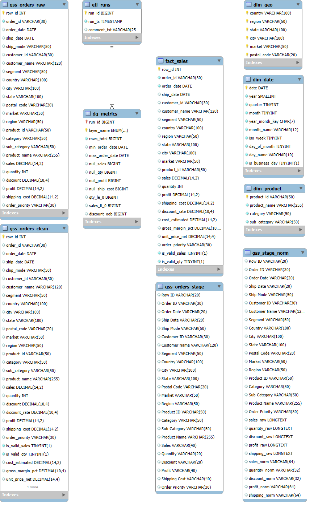
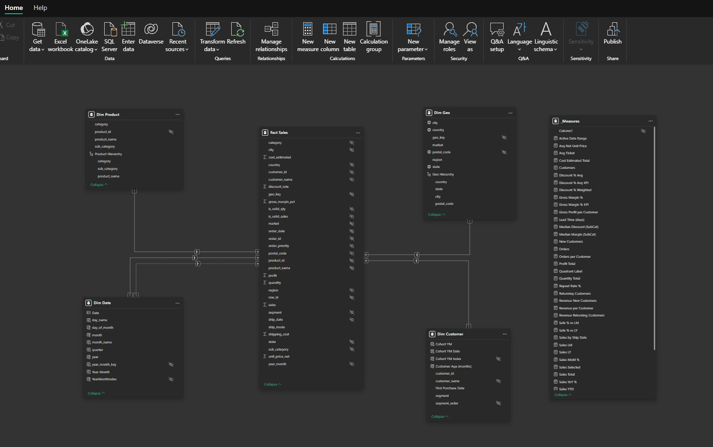
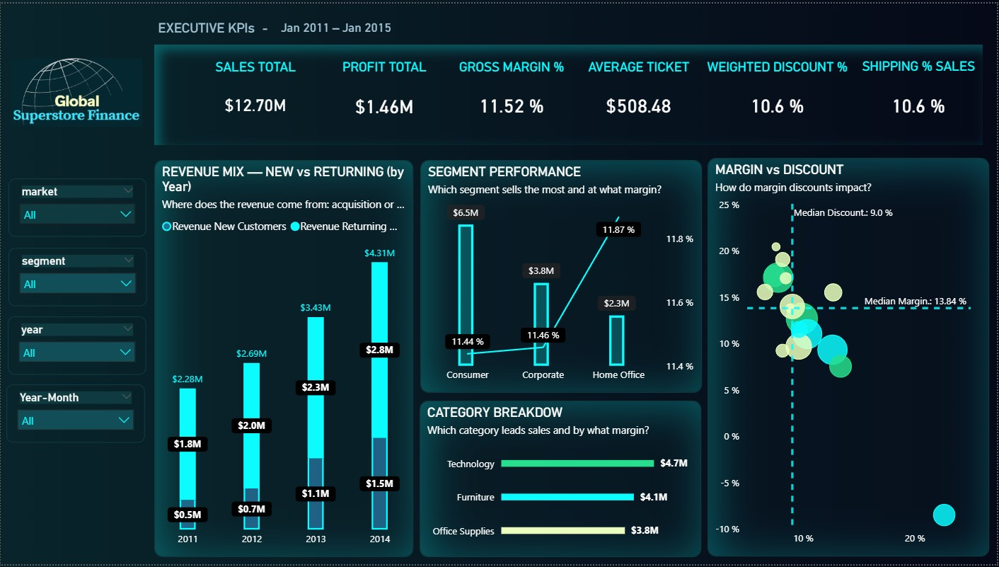
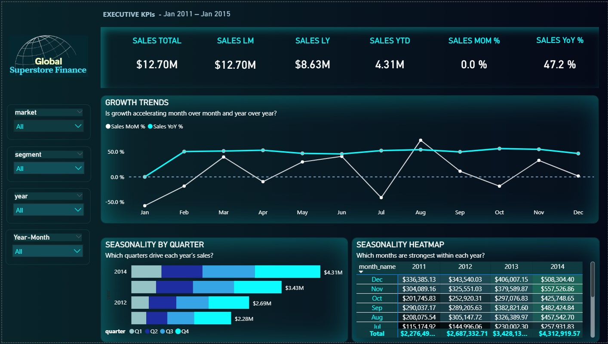
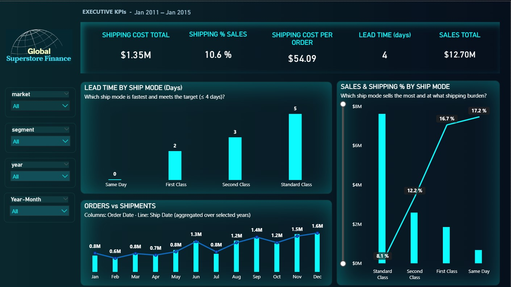

markdown
← Volver al inicio: [README principal](../README.md)

# 📊 Global Superstore — Análisis Financiero & Business Intelligence

**Autora:** Daiana Beltrán  
**Stack:** MySQL 8 · SQL (ETL, calidad de datos, modelado y seguridad) · Power BI (DAX & storytelling)

---

## Tabla de contenidos

- [Resumen ejecutivo](#resumen-ejecutivo)
- [Preguntas de negocio](#preguntas-de-negocio)
- [Índice de scripts](#índice-de-scripts)
- [Modelo de datos](#modelo-de-datos)
  - [ERD](#erd)
  - [Modelo en estrella para Power BI](#modelo-en-estrella-para-power-bi)
- [Power BI — Páginas e insights](#dashboard-pages)
  - [01 — Financial Overview](#page-1-financial-overview)
  - [02 — Time & Seasonality](#page-2-time-and-seasonality)
  - [03 — Shipping & Operations](#page-3-shipping-and-operations)
- [DAX Highlights](#dax-highlights)
- [Diccionario de KPIs SQL ↔ DAX](./kpi_dictionary.md)
- [Cómo ejecutar el proyecto paso a paso](#cómo-ejecutar-el-proyecto-paso-a-paso)
- [Arquitectura de seguridad](#arquitectura-de-seguridad)
- [Orden de ejecución](#orden-de-ejecución)
- [Valor del proyecto para mi portafolio](#valor-del-proyecto-para-mi-portafolio)

---

## Resumen ejecutivo

Este proyecto desarrolla un flujo completo de **análisis financiero y Business Intelligence**, desde la carga y limpieza de datos hasta la construcción de un dashboard ejecutivo en Power BI.

El objetivo es simular una solución profesional de BI, donde los datos pasan por distintas capas de procesamiento antes de llegar al dashboard final.

El proyecto incluye:

- **ETL robusto:** carga de datos desde CSV y transformación por capas: STAGE → RAW → CLEAN → STAR.
- **Control de calidad de datos:** validaciones, correcciones y manejo seguro de conversiones.
- **Modelo en estrella:** tabla de hechos de ventas y dimensiones de fecha, producto, cliente y geografía.
- **KPIs financieros:** ventas, profit, margen bruto, ticket promedio, descuentos y costos de envío.
- **Vistas para BI:** vistas estables y preparadas para ser consumidas desde Power BI.
- **Seguridad:** usuario de solo lectura para consumo desde BI.
- **Power BI:** dashboard ejecutivo con análisis MoM, YoY, YTD y visualizaciones orientadas a negocio.

**Resultado:** una solución de BI de nivel portafolio, pensada para mostrar capacidad técnica, criterio de negocio y comunicación visual de insights.

---

## Preguntas de negocio

Este proyecto responde preguntas clave para entender el rendimiento financiero y operativo de la empresa:

1. ¿De dónde provienen los ingresos: clientes nuevos o clientes recurrentes?  
2. ¿Qué segmentos y categorías generan más ventas y mejor margen?  
3. ¿Las ventas están creciendo mes a mes y año a año?  
4. ¿Qué trimestres y meses concentran mayor demanda?  
5. ¿Qué método de envío vende más y cuál tiene mayor carga logística?  
6. ¿La empresa cumple con el objetivo de entrega de hasta 4 días?  
7. ¿Existe backlog o acumulación de pedidos entre órdenes y despachos?

---

## Índice de scripts

> Las rutas son relativas a la raíz del repositorio. Ejecutar los scripts en orden numérico.

### ETL — `../sql_scripts/etl`

- [`00_create_database.sql`](../sql_scripts/etl/00_create_database.sql) — Crea la base de datos `global_superstore_finance`.
- [`01_create_stage_table.sql`](../sql_scripts/etl/01_create_stage_table.sql) — Crea la tabla STAGE para importar el CSV original.
- [`02d_build_stage_norm.sql`](../sql_scripts/etl/02d_build_stage_norm.sql) — Normaliza valores numéricos provenientes del archivo original.
- [`02d_fix_hyphen_decimal.sql`](../sql_scripts/etl/02d_fix_hyphen_decimal.sql) — Corrige anomalías de formato decimal.
- [`02e_load_raw_from_stage_norm.sql`](../sql_scripts/etl/02e_load_raw_from_stage_norm.sql) — Carga la capa RAW usando conversiones controladas.
- [`03_load_clean_from_raw.sql`](../sql_scripts/etl/03_load_clean_from_raw.sql) — Construye la capa CLEAN con datos preparados para modelado.
- [`05_data_quality_audit.sql`](../sql_scripts/etl/05_data_quality_audit.sql) — Crea el framework de calidad de datos: ejecuciones, métricas e incidencias.

### Modeling — `../sql_scripts/modeling`

- [`06_views_fact.sql`](../sql_scripts/modeling/06_views_fact.sql) — Crea la vista de ventas válidas para la tabla de hechos.
- [`07_views_dimensions.sql`](../sql_scripts/modeling/07_views_dimensions.sql) — Crea vistas para dimensiones: fecha, producto y geografía.
- [`08_materialize_star.sql`](../sql_scripts/modeling/08_materialize_star.sql) — Materializa las tablas FACT y DIM del modelo en estrella.
- [`09_financial_kpis.sql`](../sql_scripts/modeling/09_financial_kpis.sql) — Crea vistas de KPIs financieros: ventas, profit, margen, ticket, rankings, geografía y tendencias mensuales.

### BI — `../sql_scripts/bi`

- [`04_views_dashboard.sql`](../sql_scripts/bi/04_views_dashboard.sql) — Crea vistas ejecutivas y financieras para dashboard.
- [`10_dashboard_views.sql`](../sql_scripts/bi/10_dashboard_views.sql) — Crea vistas de tiempo, producto, geografía, cliente y logística.
- [`14_publish_bi_views.sql`](../sql_scripts/bi/14_publish_bi_views.sql) — Publica vistas finales para consumo desde Power BI.

### Admin — `../sql_scripts/admin`

- [`11_admin_and_security.sql`](../sql_scripts/admin/11_admin_and_security.sql) — Incluye ajustes de rendimiento y usuario base para BI.
- [`12_bi_role_user.sql`](../sql_scripts/admin/12_bi_role_user.sql) — Crea rol y usuario parametrizado para BI.
- [`13_bi_schema_and_grants.sql`](../sql_scripts/admin/13_bi_schema_and_grants.sql) — Crea el esquema curado de BI y otorga permisos SELECT.
- [`15_verification_tests.sql`](../sql_scripts/admin/15_verification_tests.sql) — Ejecuta pruebas de validación para verificar permisos y acceso de solo lectura.

---

## Modelo de datos

El proyecto utiliza un **modelo en estrella**, una estructura habitual en soluciones de BI porque facilita el análisis, mejora el rendimiento y permite conectar Power BI de forma más ordenada.

El modelo se compone de:

- **Fact Sales:** tabla central con métricas de ventas, profit, descuentos, costos de envío y fechas.
- **Dim Date:** dimensión de calendario para análisis temporal.
- **Dim Product:** dimensión de productos y categorías.
- **Dim Customer:** dimensión de clientes y segmentos.
- **Dim Geo:** dimensión geográfica para análisis por ubicación.

### ERD

<p align="center">
  
</p>

### Modelo en estrella para Power BI

<p align="center">
  
</p>

---

## Diccionario de KPIs

El proyecto incluye KPIs disponibles en vistas SQL y medidas DAX.

Principales indicadores:

- **Revenue / Ventas**
- **Profit / Ganancia**
- **Gross Margin % / Margen bruto**
- **Average Ticket / Ticket promedio**
- **Weighted Discount % / Descuento ponderado**
- **Shipping % of Sales / Costo de envío sobre ventas**
- **Shipping Cost per Order / Costo de envío por orden**
- **MoM / Variación mes contra mes**
- **YoY / Variación año contra año**
- **YTD / Acumulado anual**
- **Top productos, clientes, regiones y tendencias mensuales**

> Ver detalle completo en: [`docs/kpi_dictionary.md`](./kpi_dictionary.md)

---

<a id="dashboard-pages"></a>
## Power BI — Páginas e insights

<a id="page-1-financial-overview"></a>
### 01 — Financial Overview



Esta página muestra una visión general del rendimiento financiero: ventas, profit, margen, clientes, segmentos, categorías y relación entre descuentos y rentabilidad.

**Insights principales:**

- **Mix de ingresos:** aproximadamente el **70% de las ventas** proviene de **clientes recurrentes**, lo que indica una base de clientes estable.
- **Segmentos:** el segmento **Consumer** lidera en ventas, mientras que **Home Office** presenta el mejor margen relativo.
- **Categorías:** **Technology** combina alto nivel de ventas con mejor rentabilidad. **Furniture** vende en niveles similares, pero con margen más bajo.
- **Descuentos vs. margen:** la subcategoría **Tables** aparece como un punto crítico porque combina alto descuento con margen negativo. Esto sugiere revisar precios, descuentos o estrategia comercial.

---

<a id="page-2-time-and-seasonality"></a>
### 02 — Time & Seasonality



Esta página analiza la evolución de las ventas en el tiempo, la estacionalidad y los períodos de mayor demanda.

**Insights principales:**

- Se observa **crecimiento interanual sostenido** durante el período analizado.
- **Q4** es el trimestre de mayor volumen de ventas, especialmente en 2014.
- **Diciembre** se mantiene como el mes pico de ventas en todos los años.
- El patrón de estacionalidad permite anticipar períodos de alta demanda y planificar inventario, logística y campañas comerciales.

---

<a id="page-3-shipping-and-operations"></a>
### 03 — Shipping & Operations



Esta página conecta el análisis comercial con la operación logística: tiempos de entrega, modos de envío, costos relativos y relación entre órdenes y despachos.

**Insights principales:**

- **SLA de entrega ≤ 4 días:** Same Day, First Class y Second Class cumplen el objetivo.
- **Standard Class** queda fuera del SLA, con un tiempo promedio de entrega de 5 días.
- **Standard Class** concentra el mayor volumen de ventas y tiene menor carga logística relativa.
- **Same Day** es el método más costoso, por lo que debería utilizarse de forma estratégica.
- **Órdenes vs. despachos:** hacia fin de año se observa mayor cantidad de despachos que órdenes, lo que puede indicar limpieza de backlog acumulado.

---

<a id="dax-highlights"></a>
## DAX Highlights

El dashboard incluye medidas DAX para análisis financiero, comparaciones temporales y lectura dinámica de indicadores.

### Comparaciones seguras

Estas medidas evitan errores cuando no hay datos del mes anterior o del año anterior.

```DAX
Safe % vs LM =
DIVIDE([Sales Total] - [Sales LM], [Sales LM], 0)

Safe % vs LY =
DIVIDE([Sales Total] - [Sales LY], [Sales LY], 0)
```

### Time intelligence

Medida para calcular ventas acumuladas en el año.

```DAX
Sales YTD =
TOTALYTD([Sales Total], 'Dim Date'[date])
```

### Descuento ponderado

Permite calcular el descuento real ponderado por el volumen de ventas.

```DAX
Discount % Weighted =
DIVIDE(
    SUMX('Fact Sales', 'Fact Sales'[sales] * 'Fact Sales'[discount_rate]),
    [Sales Total]
)
```

### Costo de envío por orden

```DAX
Shipping Cost per Order =
DIVIDE([Shipping Cost Total], [Orders])
```

### Ventas por fecha de envío

Activa la relación con fecha de despacho para analizar ventas desde la lógica logística.

```DAX
Sales by Ship Date =
CALCULATE(
    [Sales Total],
    USERELATIONSHIP('Fact Sales'[ship_date], 'Dim Date'[date])
)
```

---

<a id="cómo-ejecutar-el-proyecto-paso-a-paso"></a>
## Cómo ejecutar el proyecto paso a paso

### 1) SQL

1. Crear la base de datos.
2. Ejecutar los scripts ubicados en `../sql_scripts` siguiendo este orden:

```text
etl/ → modeling/ → bi/ → admin/
```

3. El usuario de BI de solo lectura, **`bi_reader`**, se crea dentro de la carpeta `admin/`.
4. Las pruebas de verificación validan que el usuario de BI tenga permisos de lectura y no de modificación.

### 2) Power BI

1. Abrir la plantilla:

```text
../dashboards/powerbi/templates/GlobalSuperstore_Finance_Dashboard.pbit
```

2. Conectar el modelo al esquema:

```text
global_superstore_bi
```

3. Actualizar el modelo.
4. Explorar las páginas del dashboard.

---

<a id="arquitectura-de-seguridad"></a>
## Arquitectura de seguridad

El proyecto separa el entorno de trabajo técnico del entorno de consumo para BI.

- **Esquema administrativo:** `global_superstore_finance`, donde se realiza el ETL, modelado y construcción de tablas.
- **Esquema BI:** `global_superstore_bi`, que contiene vistas curadas y estables para Power BI.
- **Acceso por rol:** `bi_reader_role`, asociado al usuario `bi_reader`.
- **Principio de menor privilegio:** el usuario de BI solo tiene permisos de lectura mediante `SELECT`.

Esta separación simula una arquitectura profesional, donde Power BI consume datos confiables sin acceder directamente a las capas internas del proceso.

---

<a id="orden-de-ejecución"></a>
## Orden de ejecución

Ejecutar los scripts en este orden:

1. `00 → 08`  
   Creación de base de datos, ETL y modelo en estrella.

2. `09 → 10`  
   Creación de KPIs y vistas para dashboard.

3. `11 → 15`  
   Ajustes de rendimiento, seguridad, publicación de vistas BI y pruebas de verificación.

---

<a id="valor-del-proyecto-para-mi-portafolio"></a>
## Valor del proyecto para mi portafolio

Este proyecto demuestra mi capacidad para construir una solución de análisis de datos de punta a punta:

- Preparar, limpiar y transformar datos con SQL.
- Aplicar controles de calidad de datos.
- Diseñar un modelo en estrella orientado a BI.
- Crear KPIs financieros y operativos.
- Construir dashboards claros en Power BI.
- Aplicar buenas prácticas de organización, seguridad y consumo de datos.
- Comunicar insights de negocio de forma visual, clara y accionable.

---

## 👩‍💻 Autora

Proyecto realizado por **Daiana Beltrán**  
[LinkedIn](https://www.linkedin.com/in/daiana-beltran/) · [GitHub](https://github.com/daiana-analytics)
````


